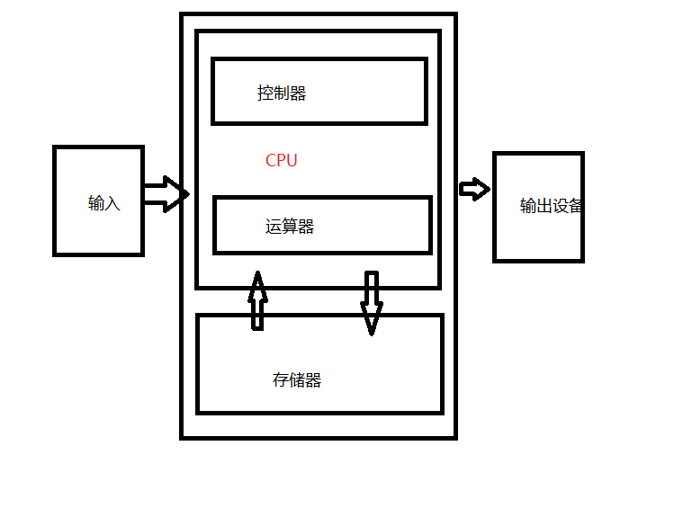

## JLL 笔试
### 1. 列举与Stream相关的类
> stream: Stream,IntStream, LongStream, DoubleStream, 
> collectors: Collectors,
> lambda function: Consumer, Function, Predicate, Supplier,
### 2. 列举加密相关的算法
> 对称加密 ：双方持有相同的密钥，约定相同的算法来加解密数据，这样双方都可以读取到对方的信息。特点是加密算法有可逆转的特性，将加密的方式逆向实现就是解密.
> 非对称加密：收信方生成一对密钥：公钥和私钥。将公钥交给发信方，发信方使用公钥加密数据，加密的数据只有用私钥才能解密。特点是公钥加密，私钥解密，但是算法复杂，所以运算量很大，不适合大量数据。
### 3. 简述GC工作流程
> JVM 的GC工作原理分为`标记-复制`、`标记-清楚`、`标记-整理` 等，根据不同年龄带的对象特点选择使用

> GC的分代 又分为新生代(eden、survivor) 老年代(Tenured) 永久代或者元空间

> GC的回收模式又分为新生代GC：youngGC，老年代GC：OldGC，在清理新生代时清楚部分老年代：MixedGC，清理整个堆：FullGC

> 在新生代，对象的特点是大部分并不能存活下来，只是作为代码运行中的临时产物，并且为了防止大量新对象生成造成oom，新生代势必需要保证有充足的可用空间，因此，标记复制算法是一个很好的选择。
> 在标记复制的过程中，会交替把eden、不为空的survivor中的存活对象复制到另一个空着的survivor区中，每次复制会修改对象的对象头中的存活次数（GC年龄），当对象存活次数到达阈值，则可以晋升至老年代

> 垃圾收集器视角： 大部分垃圾收集器都会使用标记复制算法来处理新生代，但是当新生代空间不足以分配给新对象时，标记复制算法并不能继续使用，此时将使用标记整理

> 在老年代，对象的特点是大部分都存活已久，或者是大对象（新生代GC复制效率低，因此直接进入老年代），但是也并不是完全就不能清除。在这里可能用到标记清除算法、标记整理算法
> 使用标记清除算法的原因是，它是较快清除垃圾的算法，能够减少stw时间，但是缺点也很明显，因为遍历空闲链表来删除垃圾对象，最后会造成内存碎片化。
> 当老年代无法为新进入老年代的对象分配空间时，就不得不使用标记整理算法。

> 垃圾回收器视角：大部分垃圾回收器都使用标记清除算法处理老年代，只不过在实现细节上，各有不同。
>经典的cms分4阶段来实现，G1则不同，G1从局部上来讲是标记复制，但是整体上是标记清理。并且借助每个小分区的RememberSet和CardTable机制，
> 它对老年代的清理实际上是MixedGC的方式, 会优先回收收益最大的垃圾存在的区域，并且对老年代的回收是建立在与新生代垃圾对象的引用关系之上。由于G1主要服务于大内存场景，因此fullGC成本相当高昂，所以要尽量避免

### 4. 列举项目中使用到的设计模式
1. 单例（需要全局统一时，例如数据源、json序列化器）
2. 生产者消费者 （分布式场景下异步、解藕）
3. 工厂模式 （对业务抽象后，后续的扩展可以省去很多重复逻辑）
4. 观察者模式 （省去轮询开支，只需要注册对应事件的回调动作）

### 5.	已知有1000个不重复且不重叠的点，这些点零散分布，如果点x1与点x2之间的距离小于等于m，则x2视为x1的邻点，当x1邻点个数大于n，则视{x1,x2,x3...xn…xx}形成一个集聚。如果集聚1与集聚2相交，则形成1个簇，如果集聚1不与任何另一集聚相交，则单独形成一个簇。同一个点可以属于不同的集聚，但只能属于1个簇。实现一个算法能将这1000个点划分成不同的簇，函数返回值为 [ { name: “簇1”, points: [x1,x2,x3…xx] }, { name: “簇2”, points: [xx,xx,xx…]} … ]
```java
import java.util.*;

/*
    FileName:   Cluster
    Author:     wsure
    Date:       2022/8/25
    Description:已知有1000个不重复且不重叠的点，这些点零散分布，如果点x1与点x2之间的距离小于等于m，则x2视为x1的邻点，当x1邻点个数大于n，
        则视{x1,x2,x3...xn…xx}形成一个集聚。如果集聚1与集聚2相交，则形成1个簇，如果集聚1不与任何另一集聚相交，则单独形成一个簇。
        同一个点可以属于不同的集聚，但只能属于1个簇。实现一个算法能将这1000个点划分成不同的簇，
        函数返回值为 [ { name: “簇1”, points: [x1,x2,x3…xx] }, { name: “簇2”, points: [xx,xx,xx…]} … ]
*/
public class ClusterTest {

    public static void main(String[] args) {
        Point[] input = new Point[100];
        Random r = new Random();
        for(int i = 0;i< 100;i++ ){
            input[i] = new Point(r.nextInt(1000),r.nextInt(1000));
        }
        createCluster(input,100,5)
                .stream()
                .peek( v -> System.out.printf(v.name + "  :"))
                .peek( v -> System.out.println(v.points))
                .count();
        ;

        System.out.println(distance(new Point(1,12),new Point(1,1002)));
    }

    public static List<Cluster> createCluster(Point[] points,double distance,int mix){
        HashMap<Point,List<Point>> visit = new HashMap<>();
        List<Cluster> res = new ArrayList<>();
        List<List<Point>> clusters = new ArrayList<>();
        for (int i = 0;i< points.length;i++){
            List<Point> c = null ;
            if(visit.containsKey(points[i])) {
                c = visit.get(points[i]);
            } else {
                Point p =points[i];
                c = new ArrayList<Point>(){{
                    add(p);
                }};
                clusters.add(c);
            }
            for (int j = i + 1;j< points.length ;j++) {
                double distances = distance(points[i],points[j]);
                if(distances < distance){
                    c.add(points[j]);
                    visit.put(points[j],c);
                }
            }
        }
        for (List<Point> list:clusters){
            if(list.size() < mix){
                for (Point p:list){
                    res.add(new Cluster(""+res.size(),new LinkedList<Point>(){{ add(p); }}));
                }
            } else {
                res.add(new Cluster(""+res.size(),new LinkedList<Point>(list)));
            }
        }
        return res;
    }

    public static double distance(Point a,Point b){
        return Math.sqrt(Math.pow(a.x - b.x,2)+ Math.pow(a.y - b.y,2));
    }

}
class Cluster {

        String name;

        LinkedList<Point> points;

    public Cluster(String name, LinkedList<Point> points) {
        this.name = name;
        this.points = points;
    }
}
class Point {
    int x;
    int y;

    public Point(int x, int y) {
        this.x = x;
        this.y = y;
    }

    @Override
    public String toString() {
        return "Point{" +
                "x=" + x +
                ", y=" + y +
                '}';
    }
}


```
### 6. 书写git命令：创建git仓库，绑定远程仓库，查看远程仓库地址，指定默认分支
```git
    git init xxxx
    git remote add origin git@github.com/WsureDev/xxxx
    git remote -v
    git config –global push.default main
```

### 7.
> 计算机五个组成要素：运算器、控制器、存储器、输入设备、输出设备


### 8. 已知存在一个 100 * 100的网格，在网格上存在一点A和B，点A以左上方 (a,b)为起点, B(x,y)为终点，每次行走一格且不能再次走到已经走过的格子，点A走到B的过程产生的格子数量一定得是E的倍数。实现一个算法可以得到其中的一条路线，返回值 [ (x1, y1), (x2, y2), (x3, y3) ... (xn, yn) ]
```java
import java.util.LinkedList;

/*
    FileName:   GridTest
    Author:     wsure
    Date:       2022/8/25
    Description:
*/
public class GridTest {
    int answers;
    int[][] grid;
    int tr, tc;
    int[] dr = new int[]{0, -1, 0, 1};
    int[] dc = new int[]{1, 0, -1, 0};
    int R, C;

    LinkedList<int[]> res = new LinkedList<>();
    public LinkedList<int[]> findPath(int[] a, int[] b, int e) {
        int[][] grid = new int[100][100];
        grid[a[0]][a[1]] = 1;
        grid[b[0]][b[1]] = 2;
        this.grid = grid;
        R = grid.length;
        C = grid[0].length;

        int todo = 0;
        int sr = 0, sc = 0;
        for (int r = 0; r < R; ++r){
            for (int c = 0; c < C; ++c) {
                if (grid[r][c] != -1) {
                    todo++;
                }

                if (grid[r][c] == 1) {
                    sr = r;
                    sc = c;
                } else if (grid[r][c] == 2) {
                    tr = r;
                    tc = c;
                }
            }
        }


        answers = 0;
        dfs(sr, sc, todo,new LinkedList<int[]>(),e);
        return res;
    }

    public void dfs(int r, int c, int todo,LinkedList<int[]> path,int e) {
        todo--;
        if (todo < 0) return;
        if (r == tr && c == tc) {
            if (todo == 0){
                answers++ ;
                if(path.size() % e == 0){
                    res = new LinkedList<>(path);
                }
            }
            return;
        }

        path.add(new int[]{r,c});
        grid[r][c] = 3;
        for (int k = 0; k < 4; ++k) {
            int nr = r + dr[k];
            int nc = c + dc[k];
            if (0 <= nr && nr < R && 0 <= nc && nc < C) {
                if (grid[nr][nc] % 2 == 0)
                    dfs(nr, nc, todo,path,e);
            }
        }
        grid[r][c] = 0;
        path.removeLast();
    }

    public static void main(String[] args) {
        System.out.println(new GridTest().findPath(new int[]{2,1},new int[]{99,99},10));
    }

}

```